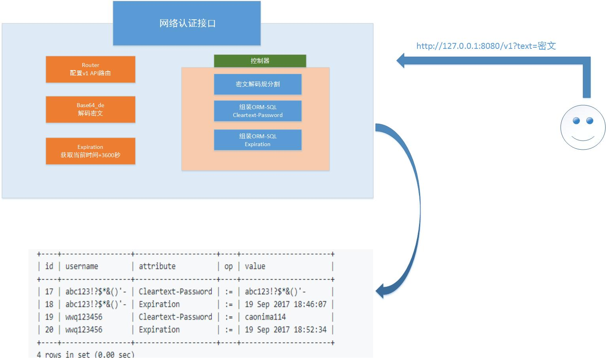

# 图片

# 功能
这个作用是用来网络认证的接口，收到密文后，解码得出账号和密码

更新到数据库里，然后设置过期时间，并且返回json。在这段有效期内，用户可以发起登录请求。

<code><pre>
/v1?text=base64密文
</code></pre>

# Installation
<pre><code>
cd $GOPATH/src/api
bee run
</code></pre>

# Usage:
<pre><code>
http://127.0.0.1:8080/v1?text=d3dxMTIzNDU2X2Nhb25pbWExMTQ=

{
  "Id": 0,
  "Username": "wwq123456",
  "Attribute": "Expiration",
  "Op": ":=",
  "Value": "19 Sep 2017 19:15:16"
}

Database changed
mysql> select * from radcheck;
+----+-----------------+--------------------+----+----------------------+
| id | username        | attribute          | op | value                |
+----+-----------------+--------------------+----+----------------------+
| 17 | abc123!?$*&()'- | Cleartext-Password | := | abc123!?$*&()'-      |
| 18 | abc123!?$*&()'- | Expiration         | := | 19 Sep 2017 18:46:07 |
| 19 | wwq123456       | Cleartext-Password | := | caonima114           |
| 20 | wwq123456       | Expiration         | := | 19 Sep 2017 18:52:34 |
+----+-----------------+--------------------+----+----------------------+
4 rows in set (0.00 sec)

mysql> select * from radcheck;
+----+-----------------+--------------------+----+----------------------+
| id | username        | attribute          | op | value                |
+----+-----------------+--------------------+----+----------------------+
| 17 | abc123!?$*&()'- | Cleartext-Password | := | abc123!?$*&()'-      |
| 18 | abc123!?$*&()'- | Expiration         | := | 19 Sep 2017 18:46:07 |
| 19 | wwq123456       | Cleartext-Password | := | caonima114           |
| 20 | wwq123456       | Expiration         | := | 19 Sep 2017 19:15:16 |
+----+-----------------+--------------------+----+----------------------+
4 rows in set (0.00 sec)

</code></pre>
